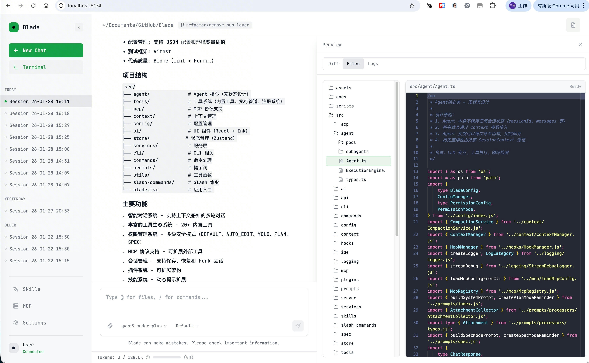

# 🌐 Web UI

> 0.2.0 版本新增功能

Blade Code 现在支持 Web UI 模式，让你可以在浏览器中使用所有核心功能。

<div align="center">
  
</div>

## 启动 Web UI

### 快速启动

```bash
blade web
```

这将启动 Web 服务器并自动打开浏览器。

### 无头服务器模式

如果你需要远程访问或不想自动打开浏览器：

```bash
blade serve --port 3000 --hostname 0.0.0.0
```

## 命令选项

| 选项 | 说明 | 默认值 |
|------|------|--------|
| `--port <port>` | 监听端口（0 为自动选择） | `0` |
| `--hostname <host>` | 监听主机名 | `127.0.0.1` |
| `--cors <domains>` | 额外允许的 CORS 域名 | `[]` |

## 安全配置

### Basic Auth 认证

设置 `BLADE_SERVER_PASSWORD` 环境变量可启用 Basic Auth 认证：

```bash
# Linux/macOS
export BLADE_SERVER_PASSWORD=your-secret-password
blade serve --port 3000

# Windows
set BLADE_SERVER_PASSWORD=your-secret-password
blade serve --port 3000
```

启用后，访问 Web UI 时需要输入：
- 用户名：`blade`
- 密码：你设置的密码

### 局域网访问

默认情况下，服务器只监听 `127.0.0.1`（本机）。要允许局域网访问：

```bash
blade serve --hostname 0.0.0.0 --port 3000
```

⚠️ **安全提示**：在局域网或公网环境中使用时，强烈建议启用 Basic Auth 认证。

## Web UI 功能

Web UI 支持 Blade Code 的所有核心功能：

- 💬 **智能对话** - 与 AI 进行多轮对话
- 📁 **文件操作** - 读取、编辑、搜索文件
- 🖥️ **终端** - 执行命令并查看输出
- 📋 **会话管理** - 创建、切换、恢复会话
- ⚙️ **模型配置** - 添加和切换模型
- 🔒 **权限控制** - 切换权限模式
- 🌍 **多语言** - 中英文界面切换

## 与 CLI 的区别

| 功能 | CLI | Web UI |
|------|-----|--------|
| 启动方式 | `blade` | `blade web` |
| 界面 | 终端 | 浏览器 |
| 远程访问 | 需要 SSH | 直接访问 |
| 会话共享 | 同一目录 | 同一目录 |
| 文件操作 | ✅ | ✅ |
| 终端执行 | ✅ | ✅ |

## 常见问题

### 端口被占用

如果默认端口被占用，可以指定其他端口：

```bash
blade web --port 8080
```

或使用 `--port 0` 让系统自动选择可用端口。

### 无法访问

1. 检查防火墙设置
2. 确认 `--hostname` 设置正确
3. 如果是远程访问，确保使用 `--hostname 0.0.0.0`

### 认证失败

确保 `BLADE_SERVER_PASSWORD` 环境变量设置正确，且浏览器中输入的密码与之匹配。
